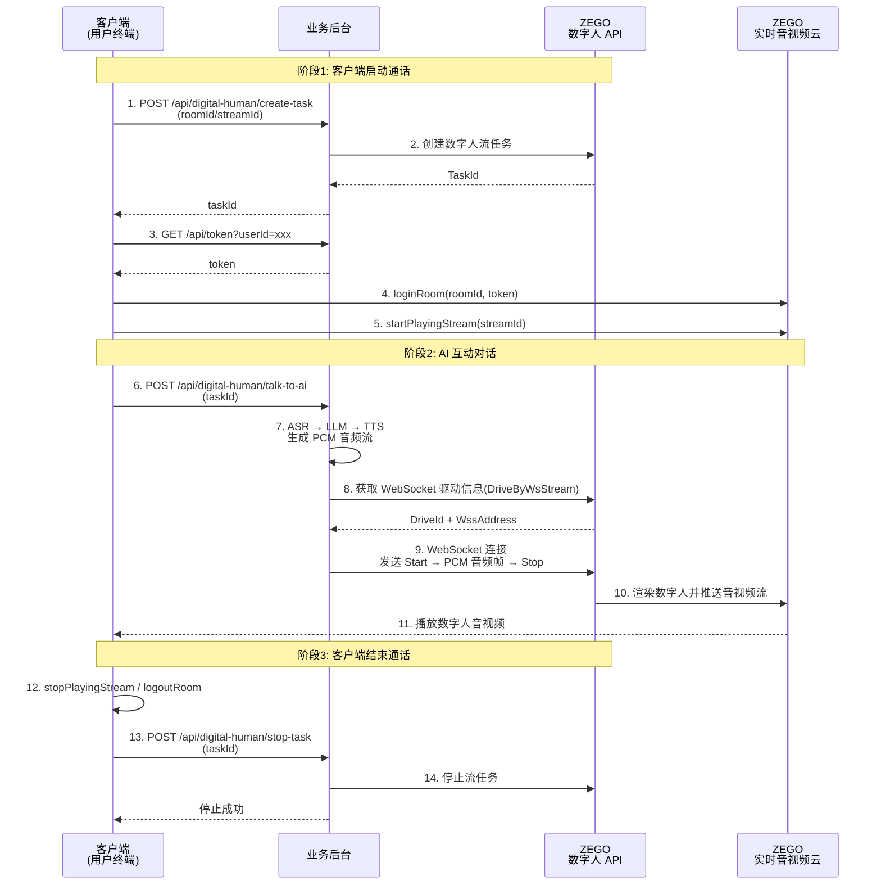

# 实现数字人 AI 互动对话

## 简介

本文介绍如何接入 ZEGO 数字人，并结合您的 LLM、ASR、TTS 等功能模块实现用户与数字人进行 AI 互动对话。

<Note title="注意">
如若您目前还没有实现AI互动对话业务，强烈建议您可直接参考[实现数字人视频通话](/aiagent-ios/quick-start-with-digital-human)，可快速实现互动对话场景。
</Note>

数字人 AI 互动对话 —— 相较于普通的用户和AI Agent 对话，数字人能够提供更具有沉浸感、更有温度的、更有个性的互动对话，为用户带来低延迟、高情感的AI对话体验。

推荐数字人AI互动对话用于以下场景
- AI教师助教&个性化辅导：K12 教育、职业培训、语言学习等场景，数字人作为智能助教，与学生实时互动，解答知识点疑问、模拟口语对话，提供规模化、个性化的教学辅导，提升学习效率与学习体验。
- 情感陪伴与虚拟好友聊天：数字人作为虚拟好友，在社交App、陪伴类小程序中与用户实时聊天解闷、倾听心事、分享日常，满足用户情感倾诉与陪伴需求，缓解孤独感，提供无压力、个性化的虚拟社交体验
- 剧本杀 / 密室逃脱智能主持与互动：剧本杀、海龟汤、密室逃脱等场景游戏中，数字人作为 DM（主持人）或 NPC，与玩家实时互动，讲解规则、推进剧情、回答疑问，帮助玩家快速进入游戏并控制游戏节奏，提升玩家体验。
- 智能顾问与售后咨询：电商、金融、运营商、政务等领域，用AI数字人代替真人工作人员，7×24 小时响应用户咨询，解答产品功能、订单物流、业务办理、政策解读等问题，提升咨询响应效率与用户满意度，实现规模化、全天候的标准化服务。
- 企业智能助手与员工服务：数字人作为企业智能助手或员工，通过官网、公众号、小程序等介绍企业产品、服务等，并与用户实时互动，解答用户疑问、引导用户行为，提升服务效率的同时实现服务的智能化、自助化
- 文旅景区 / 博物馆智能导览与互动讲解：在景区、博物馆、古镇、主题乐园中，AI数字人可通过App、小程序等终端与游客实时互动，根据预设置的内容，讲解景点内容/故事，并根据提问进行个性化回复，提升景区服务智能化水平与游客满意度。

## 前提条件

在开始实现数字人实时播报前，请确保：

- 在 [ZEGO 控制台](https://console.zego.im) 创建项目，并申请有效的 AppID，详情请参考 [控制台 - 项目管理 - 项目信息](/console/project-info)。
- 已联系 ZEGO 技术支持开通数字人 API 服务和相关接口的权限。
- 已通过 ASR、LLM、TTS 等功能实现音频互动对话业务。
- 客户端已集成 ZEGO Express SDK，详情请参考各端（[Web](/real-time-voice-web/quick-start/integrating-sdk) 、[Android](/real-time-voice-android/quick-start/integrating-sdk) 、[iOS](/real-time-voice-ios/quick-start/integrating-sdk)）集成 SDK 文档 。

## 示例代码

<CardGroup cols={2}>
  <Card title="数字人 AI 互动对话示例代码" href="https://github.com/ZEGOCLOUD/digital-human-quick-start-example/tree/main/digital-human-interactive-chat" target="_blank">
    包含服务端及客户端示例代码。
  </Card>
</CardGroup>

请参考 [跑通示例源码](/aigc-digital-human-server/quick-start/run-example-code) 或者示例代码 README 运行示例代码。

<Video src="https://doc-media.zego.im/core_products/digital-human/zh/server/quick-start/interactive-chat.mp4" />

## 核心架构

数字人 AI 互动对话系统通常由三个核心角色组成：

### 1. 客户端（用户终端）
- **功能**：使用 ZEGO Express SDK 拉取并播放数字人音视频流，同时采集用户音频发送至业务后台
- **平台**：Web / Android / iOS，均使用 Express SDK 拉流播放

### 2. 业务后台
- **核心职责**：接收客户端请求，调用 ZEGO 数字人 API 创建/停止数字人任务
- **AI 交互处理**：接收用户音频，经 ASR（语音识别）→ LLM（大语言模型）→ TTS（语音合成）处理后，通过 WebSocket 将 PCM 音频流发送给数字人服务驱动数字人

### 3. ZEGO 服务端
- **数字人 API**：创建数字人视频流任务、获取 WebSocket 驱动信息、停止数字人视频流任务
- **实时音视频云**：数字人音视频流通过 ZEGO 实时音视频云推送，客户端通过 ZEGO Express SDK 拉取

<Frame width="512" height="auto" caption=""></Frame>

## 业务流程

1. **客户端启动通话：**
   - 客户端生成 roomId 和 streamId，向业务后台发起创建数字人任务请求。
   - 业务后台调用 ZEGO 数字人 API 创建任务，返回 taskId。
   - 客户端获取 Token，登录 RTC 房间并拉取数字人音视频流。

2. **AI 互动对话：**
   - 客户端采集用户说话音频，发送至业务后台。
   - 业务后台进行 ASR → LLM → TTS 处理，生成 PCM 音频流。
   - 业务后台调用数字人 API 获取 WebSocket 驱动信息，建立 WebSocket 连接，将 PCM 音频流转发给数字人服务驱动数字人。

3. **客户端结束通话：**
   - 客户端停止拉流、退出房间，并请求业务后台停止数字人任务。
   - 业务后台调用数字人 API 停止任务。



## 实现逻辑

### 实现业务后台

业务后台提供以下接口供客户端调用：

| 端点 | 方法 | 请求参数 | 说明 | 相关数字人 API |
|------|------|---------|------|------------------------|
| `/api/digital-human/create-task` | POST | `roomId`, `streamId` | 创建数字人视频流任务 | [创建数字人视频流任务](/aigc-digital-human-server/streaming-apis/digital-human-streaming/create-digital-human-stream-task) |
| `/api/digital-human/talk-to-ai` | POST | `taskId`, `lang`（可选） | AI 互动对话（ASR → LLM → TTS → WebSocket 驱动数字人） | [WebSocket 音频流驱动数字人](/aigc-digital-human-server/streaming-apis/digital-human-streaming/drive-by-ws-stream) |
| `/api/digital-human/stop-task` | POST | `taskId` | 停止数字人视频流任务 | [停止数字人视频流任务](/aigc-digital-human-server/streaming-apis/digital-human-streaming/stop-digital-human-stream-task) |
| `/api/token` | GET | `userId` | 获取 ZEGO 客户端 SDK 用的 Token。<br/>请参考[使用 Token 鉴权](/real-time-video-ios-oc/communication/using-token-authentication)文档或[示例代码](https://github.com/ZEGOCLOUD/digital-human-quick-start-example/blob/main/digital-human-interactive-chat/server/lib/token.js)生成 Token | 纯业务后台逻辑 |

请根据实际业务需求设计业务后台接口，并按照数字人 API [调用方式](/aigc-digital-human-server/streaming-apis/accessing-server-apis)说明实现必要的业务后台接口。以下是调用数字人 API 的示例代码：

```javascript
// 创建数字人视频流任务
// Create digital human video stream task
export const createStreamTask = async (params) => {
  const data = await post("CreateDigitalHumanStreamTask", {
    DigitalHumanConfig: { DigitalHumanId: params.digitalHumanId },
    RTCConfig: { RoomId: params.roomId, StreamId: params.streamId },
  });
  return data.TaskId;
};

// 停止数字人视频流任务
// Stop digital human video stream task
export const stopStreamTask = async (params) => {
  await post("StopDigitalHumanStreamTask", { TaskId: params.taskId });
};

// 获取 WebSocket 驱动信息
// Get WebSocket drive info
export const getDriveByWsStreamInfo = async (params) => {
  const data = await post("DriveByWsStream", { TaskId: params.taskId });
  return {
    driveId: data.DriveId,
    wssAddress: data.WssAddress,
  };
};

// 发送 POST 请求到 ZEGO 数字人 API
// Send POST request to ZEGO Digital Human API
const post = async (action, body) => {
  const params = buildCommonParams(action);
  const url = `https://aigc-digitalhuman-api.zegotech.cn/?${params.toString()}`;
  const response = await fetch(url, {
    method: "POST",
    headers: { "Content-Type": "application/json" },
    body: JSON.stringify(body),
  });
  const data = await response.json();
  if (data.Code !== 0) {
    throw new Error(`Digital Human API failed: ${data.Code} ${data.Message}`);
  }
  return data.Data;
};

// 构建通用 API 请求参数（包含签名）
// Build common API request parameters (including signature)
const buildCommonParams = (action) => {
  const appId = process.env.APP_ID;
  const serverSecret = process.env.SERVER_SECRET || "";
  const signatureNonce = crypto.randomBytes(8).toString("hex");
  const timestamp = Math.floor(Date.now() / 1000);
  // 计算 MD5 签名
  // Calculate MD5 signature
  const signature = crypto
    .createHash("md5")
    .update(`${appId}${signatureNonce}${serverSecret}${timestamp}`)
    .digest("hex");

  return new URLSearchParams({
    Action: action,
    AppId: appId.toString(),
    SignatureNonce: signatureNonce,
    Timestamp: timestamp.toString(),
    Signature: signature,
    SignatureVersion: "2.0",
  });
};
```


#### 通过 WebSocket 音频流驱动数字人

AI 互动对话的核心在于将 TTS 合成的 PCM 音频流通过 WebSocket 发送给数字人服务，驱动数字人说话。流程如下：

1. 调用 `DriveByWsStream` 获取 WebSocket 驱动信息（DriveId 和 WssAddress）
2. 建立 WebSocket 连接
3. 发送 `Start` 指令（指定 DriveId 和采样率）
4. 将 TTS 产生的 PCM 音频数据逐帧发送
5. 发送 `Stop` 指令
6. 断开 WebSocket 连接

```javascript
import WebSocket from "ws";

// 通过 WebSocket 驱动数字人
// Drive digital human via WebSocket
export const callTTSAndDriveDigitalHumanByWebSocket = async (taskId) => {
  // 步骤 1: 获取 WebSocket 驱动信息
  const { driveId, wssAddress } = await getDriveByWsStreamInfo({ taskId });

  // 步骤 2: 建立 WebSocket 连接
  const ws = new WebSocket(wssAddress, { rejectUnauthorized: false });
  await new Promise((resolve, reject) => {
    ws.on("open", resolve);
    ws.on("error", reject);
  });

  // 步骤 3: 发送 Start 指令（通常在 TTS 开启前启动）
  ws.send(JSON.stringify({
    Action: "Start",
    Payload: {
      DriveId: driveId,
      SampleRate: 24000, // 采样率需与你实际的音频数据相同
    },
  }));

  // 步骤 4: 将 TTS 产生的 PCM 音频数据逐帧发送
  // 实际业务中，这里应接收 TTS 服务返回的流式 PCM 音频数据并转发：
  // ttsWs.onMessage = (msg) => {
  //   if (msg.type === 'MsgTypeAudioOnlyServer') {
  //     ws.send(msg.payload);  // 将 PCM 音频帧直接转发给数字人
  //   }
  // };

  // 步骤 5: 发送 Stop 指令（通常在 TTS 结束后发送）
  ws.send(JSON.stringify({
    Action: "Stop",
    Payload: { DriveId: driveId },
  }));

  // 步骤 6: 断开连接
  ws.close();
};
```

### 实现客户端

客户端使用 ZEGO Express SDK 拉流播放数字人音视频，详情请参考各端（[Web](/real-time-voice-web/quick-start/implementing-video-call) 、[Android](/real-time-voice-android/quick-start/implementing-video-call) 、[iOS](/real-time-video-ios-oc/quick-start/implementing-video-call)）实现视频通话文档。

以下是各端的核心示例代码。详细实现可参考示例代码（[Web](https://github.com/ZEGOCLOUD/digital-human-quick-start-example/blob/main/digital-human-interactive-chat/web-react/src/App.jsx) 、[Android](https://github.com/ZEGOCLOUD/digital-human-quick-start-example/blob/main/digital-human-interactive-chat/android/app/src/main/java/com/example/digitalhumanquickstartdemo/MainActivity.kt) 、[iOS](https://github.com/ZEGOCLOUD/digital-human-quick-start-example/blob/main/digital-human-interactive-chat/ios-oc/ZegoDigitalHumanQuickStart/ZegoDigitalHumanQuickStart/ViewController.m)）：

<CodeGroup>

```javascript Web
// 步骤1: 初始化 Express SDK
const zg = new ZegoExpressEngine(appId, server);

// 步骤2: 生成唯一标识
const userId = `user_${Date.now()}`;
const roomId = `room_${Date.now()}`;
const streamId = `stream_${Date.now()}`;

// 步骤3: 调用业务后台创建数字人任务
const createRes = await fetch('https://your_server_address/api/digital-human/create-task', {
  method: 'POST',
  headers: { 'Content-Type': 'application/json' },
  body: JSON.stringify({ roomId, streamId }),
});
const { taskId } = await createRes.json();

// 步骤4: 获取 Token
const tokenRes = await fetch(`https://your_server_address/api/token?userId=${userId}`);
const { token } = await tokenRes.json();

// 步骤5: 登录 RTC 房间
await zg.loginRoom(roomId, token, { userID: userId, userName: userId });

// 步骤6: 拉取数字人音视频流
const remoteStream = await zg.startPlayingStream(streamId);
const remoteView = zg.createRemoteStreamView(remoteStream);
remoteView.play('remote-video'); // 渲染到 DOM 元素

// 步骤7: 模拟 AI 互动（实际场景中应采集麦克风音频发送至业务后台）
await fetch('https://your_server_address/api/digital-human/talk-to-ai', {
  method: 'POST',
  headers: { 'Content-Type': 'application/json' },
  body: JSON.stringify({ taskId }),
});

// 步骤8: 结束通话
await zg.stopPlayingStream(streamId);
await zg.logoutRoom();
await fetch('https://your_server_address/api/digital-human/stop-task', {
  method: 'POST',
  headers: { 'Content-Type': 'application/json' },
  body: JSON.stringify({ taskId }),
});
```
```java Android
// 步骤1: 初始化 Express SDK
ZegoEngineProfile profile = new ZegoEngineProfile();
profile.appID = appId;
profile.scenario = ZegoScenario.HIGH_QUALITY_CHATROOM;
ZegoExpressEngine.createEngine(profile, null);

// 步骤2: 调用业务后台创建数字人任务
// POST https://your_server_address/api/digital-human/create-task
// 请求参数：{ "roomId": "room_xxx", "streamId": "stream_xxx" }
// 返回：{ "taskId": "xxx" }

// 步骤3: 获取 Token
// GET https://your_server_address/api/token?userId=xxx
// 返回 token

// 步骤4: 登录房间并拉流
ZegoUser user = new ZegoUser(userId, userId);
ZegoRoomConfig config = new ZegoRoomConfig();
config.token = token;
ZegoExpressEngine.getEngine().loginRoom(roomId, user, config, (errorCode, extendedData) -> {
    if (errorCode == 0) {
        // 使用 ZegoCanvas 包装 TextureView 进行渲染
        ZegoCanvas canvas = new ZegoCanvas(findViewById(R.id.remote_video_view));
        ZegoExpressEngine.getEngine().startPlayingStream(streamId, canvas);
    }
});

// 步骤5: 模拟 AI 互动（实际场景中应采集麦克风音频发送至业务后台）
// POST https://your_server_address/api/digital-human/talk-to-ai
// 请求参数：{ "taskId": "xxx" }

// 步骤6: 结束通话
ZegoExpressEngine.getEngine().stopPlayingStream(streamId);
ZegoExpressEngine.getEngine().logoutRoom();
// POST https://your_server_address/api/digital-human/stop-task
// 请求参数：{ "taskId": "xxx" }
```
```oc iOS
// 步骤1: 初始化 Express SDK
ZegoEngineProfile *profile = [[ZegoEngineProfile alloc] init];
profile.appID = (unsigned int)appId;
profile.scenario = ZegoScenarioHighQualityChatroom;
self.expressEngine = [ZegoExpressEngine createEngineWithProfile:profile eventHandler:self];

// 步骤2: 调用业务后台创建数字人任务
// POST https://your_server_address/api/digital-human/create-task
// 请求参数：{ "roomId": "room_xxx", "streamId": "stream_xxx" }
// 返回：{ "taskId": "xxx" }

// 步骤3: 获取 Token
// GET https://your_server_address/api/token?userId=xxx
// 返回 token

// 步骤4: 登录房间并拉流
ZegoUser *user = [[ZegoUser alloc] init];
user.userID = userId;
user.userName = userId;
ZegoRoomConfig *roomConfig = [[ZegoRoomConfig alloc] init];
roomConfig.token = token;
[self.expressEngine loginRoom:roomId user:user config:roomConfig callback:^(int errorCode, NSDictionary *extendedData) {
    if (errorCode == 0) {
        // 使用 ZegoCanvas 包装 UIView 进行渲染
        ZegoCanvas *canvas = [ZegoCanvas canvasWithView:self.remoteVideoView];
        [self.expressEngine startPlayingStream:streamId canvas:canvas];
    }
}];

// 步骤5: 模拟 AI 互动（实际场景中应采集麦克风音频发送至业务后台）
// POST https://your_server_address/api/digital-human/talk-to-ai
// 请求参数：{ "taskId": "xxx" }

// 步骤6: 结束通话
[self.expressEngine stopPlayingStream:streamId];
[self.expressEngine logoutRoom:roomId];
// POST https://your_server_address/api/digital-human/stop-task
// 请求参数：{ "taskId": "xxx" }
```
</CodeGroup>
