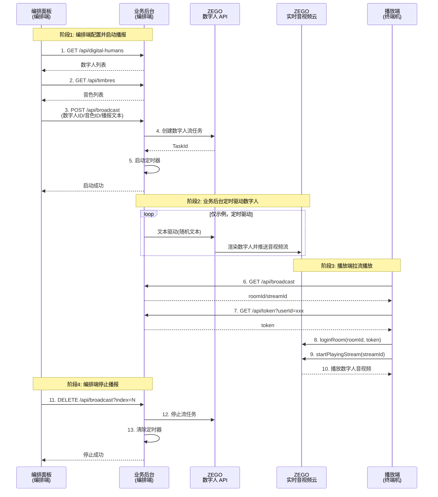

# 实现数字人实时播报

## 简介

本文介绍如何快速实现数字人实时播报。

数字人实时播报——基于 ZEGO 自研的数字人AI推理引擎，可实时接收文本 / 音视频流输入，快速生成并输出拟人化语音、表情与动作的数字人播报内容，实现低延迟、高真实感的实时信息传递。

推荐数字人实时播报用于以下场景
- 新闻资讯实时播报：针对热点新闻、财经快讯等，数字人快速接收最新信息并进行口播；响应快、更新及时、7×24 小时不间断，可多语种、多风格切换。
- 电商直播实时带货：数字人作为虚拟主播，实时讲解商品卖点、回答用户弹幕问题、介绍商品促销信息，可 7×24 小时不间断直播，实现规模化、低成本的实时带货运营。
- 体育赛事实时解说：1:1还原真人主播形象、声音、解说风格，实现全时段、多赛事、多语种的实时解说覆盖，解决专业解说员稀缺与成本高的问题，提升赛事传播效率。
- 教育课堂实时授课 / 答疑：在线课堂、K12 辅导、职业培训，AI数字人老师实时讲解知识点、同步课件、回答学生问题，支持录播 + 实时互动结合，实现规模化、标准化的实时教学与答疑服务。
- 企业 / 政务信息实时发布：企业公众号、官网等媒介实时进行新品介绍、重要通知等信息，面向内部员工或公众传递。实时更新重要信息进行官方同步，提升信息传递效率，降低线下发布会与人工播报成本。
- 金融实时行情播报：为投资者提供 7×24 小时不间断的行情解读，降低专业分析师人力成本，提升信息服务的时效性与覆盖面。
- 短视频 / 自媒体实时内容创作：通过数字人快速实时生成热点解读、知识科普、专业知识介绍等精品内容，实现热点内容的快速响应与规模化产出。
- 文旅景区 / 博物馆实时导游导览：数字人通过景区大屏、游客手机端、AR 眼镜等终端，实时讲解景点历史文化、文物背景、游玩路线、特色体验与安全提示，支持多语种、多风格切换。

## 前提条件

在开始实现数字人实时播报前，请确保：

- 在 [ZEGO 控制台](https://console.zego.im) 创建项目，并申请有效的 AppID，详情请参考 [控制台 - 项目管理 - 项目信息](/console/project-info)。
- 已联系 ZEGO 技术支持开通数字人 API 服务和相关接口的权限。
- 客户端已集成 ZEGO Express SDK，详情请参考各端（[Web](/real-time-voice-web/quick-start/integrating-sdk) 、[Android](/real-time-voice-android/quick-start/integrating-sdk) 、[iOS](/real-time-voice-ios/quick-start/integrating-sdk)）集成 SDK 文档 。

## 示例代码

<CardGroup cols={2}>
  <Card title="数字人实时播报示例代码" href="https://github.com/ZEGOCLOUD/digital-human-quick-start-example/tree/main/digital-human-real-time-broadcasting-scenario" target="_blank">
    包含服务端及客户端示例代码。
  </Card>
</CardGroup>

请参考 [跑通示例源码](/aigc-digital-human-server/quick-start/run-example-code) 或者示例代码 README 运行示例代码。

<Video src="https://doc-media.zego.im/core_products/digital-human/zh/server/quick-start/real-time-broadcasting.mp4" />

## 核心架构


数字人实时播报系统通常由三个核心角色组成：

### 1. 播放端（终端机）
- **功能**：使用 ZEGO Express SDK 拉取并播放数字人音视频流
- **平台**：Web / Android / iOS，均使用 Express SDK 拉流播放

### 2. 编排端（编排面板 + 业务服务）
- **编排面板**：Web UI，用于配置数字人播报内容
  - 选择数字人形象和音色
  - 配置播报文本内容
  - 启动/停止播报任务
- **业务服务**：接收编排指令，调用 ZEGO 数字人 API 驱动数字人

### 3. ZEGO 服务端
- **数字人 API**：创建数字人视频流任务、文本驱动数字人、音频驱动数字人、停止数字人视频流任务
- **实时音视频云**：数字人音视频流通过 ZEGO 实时音视频云推送，播放端通过 ZEGO Express SDK 拉取

<Frame width="512" height="auto" caption=""></Frame>

## 业务流程

1. **编排端配置与启动：**
   - 编排端获取数字人列表、音色列表，配置播报任务内容，向业务后台发起启动请求。
   - 业务后台根据请求调用 ZEGO 数字人 API 创建任务，启动文本/音频驱动，返回启动结果。

2. **数字人驱动与推流：**
   - 业务后台持续调用数字人 API 进行文本/音频驱动，数字人服务生成数字人画面并持续向音视频云推送音视频流。

3. **播放端拉流播放：**
   - 播放端获取最新播报任务的信息（roomId/streamId）及用户 token。
   - 播放端登录房间并拉流，实现数字人音视频实时播放。

4. **编排端停止播报：**
   - 编排端请求业务后台停止指定任务，业务后台调用数字人 API 停止任务，返回停止结果。



## 实现逻辑

### 实现编排端业务后台

业务后台提供两类接口，分别供编排端（编排面板）和播放端（终端机）调用：

编排端（编排面板）调用以下接口配置和管理播报任务：

| 端点 | 方法 | 请求参数 | 说明 | 相关数字人 API |
|------|------|---------|------|------------------------|
| `/api/digital-humans` | GET | - | 获取数字人列表 | [获取数字人形象列表](/aigc-digital-human-server/streaming-apis/digital-human-management/get-digital-human-list) |
| `/api/timbres` | GET | `digitalHumanId`（可选） | 获取音色列表 | [获取音色列表](/aigc-digital-human-server/streaming-apis/timbre-management/get-timbre-list) |
| `/api/broadcast` | POST | `digitalHumanId`, `timbreId`, `roomId`, `streamId`, `textPool` | 启动播报任务 | [创建数字人视频流任务](/aigc-digital-human-server/streaming-apis/digital-human-streaming/create-digital-human-stream-task) / [文本驱动数字人](/aigc-digital-human-server/streaming-apis/digital-human-streaming/drive-by-text) |
| `/api/broadcast?index=N` | DELETE | `index`（查询参数） | 停止指定播报任务 | [停止数字人视频流任务](/aigc-digital-human-server/streaming-apis/digital-human-streaming/stop-digital-human-stream-task) |

播放端（终端机）调用以下接口获取播放信息：

| 端点 | 方法 | 请求参数 | 说明 | 相关数字人 API |
|------|------|---------|------|-----------------------------|
| `/api/broadcast` | GET | - | 获取播报列表信息（包含 roomId/streamId） | 纯业务后台逻辑 |
| `/api/token` | GET | `userId` | 获取 ZEGO 客户端 SDK 用的 Token。<br/>请参考[使用 Token 鉴权](/real-time-video-ios-oc/communication/using-token-authentication)文档或[示例代码](https://github.com/ZEGOCLOUD/digital-human-quick-start-example/blob/main/digital-human-real-time-broadcasting-scenario/server/app/api/token/route.js)生成 Token | 纯业务后台逻辑|

请根据实际业务需求设计业务后台接口，并按照数字人 API [调用方式](/aigc-digital-human-server/streaming-apis/accessing-server-apis)说明实现必要的业务后台接口。以下是调用数字人 API 的示例代码：

```javascript
// 获取数字人列表
// Get digital human list
export const getDigitalHumanList = async (params) => {
  const body = {};
  if (params.inferenceMode !== undefined) {
    body.InferenceMode = params.inferenceMode;
  }
  if (params.fetchMode !== undefined) {
    body.FetchMode = params.fetchMode;
  }
  if (params.offset !== undefined) {
    body.Offset = params.offset;
  }
  if (params.limit !== undefined) {
    body.Limit = params.limit;
  }

  const data = await post("GetDigitalHumanList", body);
  return data;
};


// 发送 POST 请求到 ZEGO 数字人 API
// Send POST request to ZEGO Digital Human API
const post = async (action, body) => {
  const params = buildCommonParams(action);
  const url = `https://aigc-digitalhuman-api.zegotech.cn/?${params.toString()}`;
  const response = await fetch(url, {
    method: "POST",
    headers: { "Content-Type": "application/json" },
    body: JSON.stringify(body),
  });
  const data = await response.json();
  if (data.Code !== 0) {
    throw new Error(`Digital Human API failed: ${data.Code} ${data.Message}`);
  }
  return data.Data;
};

// 构建通用 API 请求参数（包含签名）
// Build common API request parameters (including signature)
const buildCommonParams = (action) => {
  const appId = process.env.APP_ID;
  const serverSecret = process.env.SERVER_SECRET || "";
  const signatureNonce = crypto.randomBytes(8).toString("hex");
  const timestamp = Math.floor(Date.now() / 1000);
  // 计算 MD5 签名
  // Calculate MD5 signature
  const signature = crypto
    .createHash("md5")
    .update(`${appId}${signatureNonce}${serverSecret}${timestamp}`)
    .digest("hex");

  return new URLSearchParams({
    Action: action,
    AppId: appId.toString(),
    SignatureNonce: signatureNonce,
    Timestamp: timestamp.toString(),
    Signature: signature,
    SignatureVersion: "2.0",
  });
};
```

### 实现编排端 UI

请参考[示例代码](https://github.com/ZEGOCLOUD/digital-human-quick-start-example/blob/main/digital-human-real-time-broadcasting-scenario/server/app/page.jsx)实现编排端 UI 或者按自己业务逻辑实现。

### 实现播放端

播放端使用 ZEGO Express SDK 拉流播放，详情请参考各端（[Web](/real-time-voice-web/quick-start/implementing-video-call) 、[Android](/real-time-voice-android/quick-start/implementing-video-call) 、[iOS](/real-time-video-ios-oc/quick-start/implementing-video-call)）实现视频通话文档 。

以下是各端拉流播放的核心示例代码。详细实现可参考示例代码（[Web](https://github.com/ZEGOCLOUD/digital-human-quick-start-example/blob/390fff54fbb58f2f3fb5684401ccda4d94d80cbd/digital-human-real-time-broadcasting-scenario/web-react/src/App.jsx#L29) 、[Android](https://github.com/ZEGOCLOUD/digital-human-quick-start-example/blob/390fff54fbb58f2f3fb5684401ccda4d94d80cbd/digital-human-real-time-broadcasting-scenario/android/app/src/main/java/com/example/digitalhumanquickstartdemo/MainActivity.kt) 、[iOS](https://github.com/ZEGOCLOUD/digital-human-quick-start-example/blob/390fff54fbb58f2f3fb5684401ccda4d94d80cbd/digital-human-real-time-broadcasting-scenario/ios-oc/ZegoDigitalHumanQuickStart/ZegoDigitalHumanQuickStart/ViewController.m)）：

<CodeGroup>

```javascript Web
// 步骤1: 获取播报信息
const broadcastRes = await fetch('https://your_server_address/api/broadcast');
const { broadcastList } = await broadcastRes.json();
const { roomId, streamId } = Object.values(broadcastList)[0];

// 步骤2: 获取 Token
const userId = 'terminal_001';
const tokenRes = await fetch(`https://your_server_address/api/token?userId=${userId}`);
const { token } = await tokenRes.json();

// 步骤3: 初始化 Express SDK
const { ZegoExpressEngine } = await import('zego-express-engine-webrtc');
const engine = new ZegoExpressEngine(appId, "");

// 步骤4: 登录 RTC 房间
await engine.loginRoom(roomId, token, {
  userID: userId,
  userName: userId
});

// 步骤5: 拉取数字人音视频流
const remoteStream = await engine.startPlayingStream(streamId);
const remoteView = engine.createRemoteStreamView(remoteStream);
remoteView.play('remote-video'); // 渲染到 DOM 元素
```
```java Android
// 步骤1: 获取播报信息
// GET https://your_server_address/api/broadcast 返回，取第一个播报任务做示例：
// { "roomId": "room_001", "streamId": "stream_001" }

// 步骤2: 获取 Token
// GET https://your_server_address/api/token?userId=xxx
// 返回 token

// 步骤3: 初始化 Express SDK
ZegoEngineProfile profile = new ZegoEngineProfile();
profile.appID = appId;
profile.scenario = ZegoScenario.HIGH_QUALITY_CHATROOM;
ZegoExpressEngine.createEngine(profile, null);

// 步骤4: 登录房间并拉流
ZegoUser user = new ZegoUser(userId, userId);
ZegoRoomConfig config = new ZegoRoomConfig();
config.token = token;
ZegoExpressEngine.getEngine().loginRoom(roomId, user, config, (errorCode, extendedData) -> {
    if (errorCode == 0) {
        // 使用 ZegoCanvas 包装 TextureView 进行渲染
        ZegoCanvas canvas = new ZegoCanvas(findViewById(R.id.remote_video_view));
        ZegoExpressEngine.getEngine().startPlayingStream(streamId, canvas);
    }
});
```
```oc iOS
// 步骤1: 获取播报信息
// GET https://your_server_address/api/broadcast 返回，取第一个播报任务做示例：
// { "roomId": "room_001", "streamId": "stream_001" }

// 步骤2: 获取 Token
// GET https://your_server_address/api/token?userId=xxx
// 返回 token

// 步骤3: 初始化 Express SDK
ZegoEngineProfile *profile = [[ZegoEngineProfile alloc] init];
profile.appID = (unsigned int)appId;
profile.scenario = ZegoScenarioHighQualityChatroom;
self.expressEngine = [ZegoExpressEngine createEngineWithProfile:profile eventHandler:self];

// 步骤4: 登录房间并拉流
ZegoUser *user = [[ZegoUser alloc] init];
user.userID = userId;
user.userName = userId;
ZegoRoomConfig *roomConfig = [[ZegoRoomConfig alloc] init];
roomConfig.token = token;
[self.expressEngine loginRoom:roomId user:user config:roomConfig callback:^(int errorCode, NSDictionary *extendedData) {
    if (errorCode == 0) {
        // 使用 ZegoCanvas 包装 UIView 进行渲染
        ZegoCanvas *canvas = [ZegoCanvas canvasWithView:self.remoteVideoView];
        [self.expressEngine startPlayingStream:streamId canvas:canvas];
    }
}];
```
</CodeGroup>
