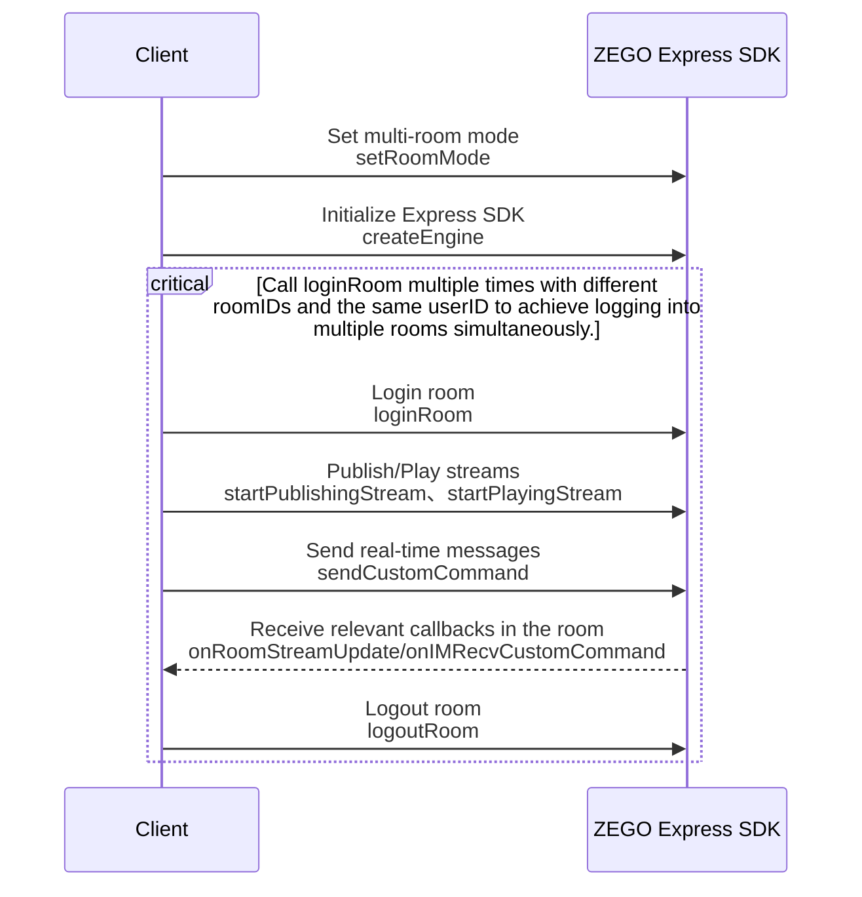

# Multi-Room Login

---

## Prerequisites

Before implementing multi-room functionality, please ensure:

- You have integrated ZEGO Express SDK (version 2.9.0 and above) in your project and implemented basic real-time audio and video functionality. For details, please refer to [Quick Start - Integration](/real-time-video-electron-js/quick-start/integrating-sdk) and [Quick Start - Implementation](/real-time-video-electron-js/quick-start/implementing-video-call).
- You have created a project in the [ZEGO Console](https://console.zego.im) and applied for a valid AppID and AppSign. For details, please refer to "Project Information" in [Console - Project Management](/console/project-info).

- You have contacted ZEGO technical support to activate multi-room functionality.


## Usage Steps

Taking the same user joining two rooms as an example, the overall implementation flow is as follows:


{/*
<Frame width="512" height="auto" caption=""></Frame>
*/}

1. Before initializing the SDK, set the room mode to multi-room.
2. Initialize the SDK.
3. Join the first room. After successful login, you can publish streams, play streams, send and receive real-time messages in that room.
4. Join the second room. After successful login, you can publish streams, play streams, send and receive real-time messages in that room.
5. Leave the first and second rooms. There is no timing restriction for leaving rooms.

The implementation of specific functions is as follows:


## Example Source Code Download

Please refer to [Download Example Source Code](/real-time-video-electron-js/quick-start/run-example-code) to obtain the source code.

For related source code, please check the files in the "/ZegoExpressExample/Others/src/main/java/im/zego/others/multiplerooms" directory.

## Prerequisites

Before implementing multi-room functionality, please ensure:

- You have integrated ZEGO Express SDK (version 2.9.0 and above) in your project and implemented basic real-time audio and video functionality. For details, please refer to [Quick Start - Integration](/real-time-video-electron-js/quick-start/integrating-sdk) and [Quick Start - Implementation](/real-time-video-electron-js/quick-start/implementing-video-call).
- You have created a project in the [ZEGO Console](https://console.zego.im) and applied for a valid AppID and AppSign. For details, please refer to "Project Information" in [Console - Project Management](/console/project-info).

- You have contacted ZEGO technical support to activate multi-room functionality.


## Usage Steps

Taking the same user joining two rooms as an example, the overall implementation flow is as follows:


{/*
<Frame width="512" height="auto" caption=""></Frame>
*/}

1. Before initializing the SDK, set the room mode to multi-room.
2. Initialize the SDK.
3. Join the first room. After successful login, you can publish streams, play streams, send and receive real-time messages in that room.
4. Join the second room. After successful login, you can publish streams, play streams, send and receive real-time messages in that room.
5. Leave the first and second rooms. There is no timing restriction for leaving rooms.

The implementation of specific functions is as follows:


### 1 Set Multi-Room Mode

Before initializing the SDK, you must call the [setRoomMode](@setRoomMode) interface and set the room mode to multi-room mode through the [ZegoRoomMode](@-ZegoRoomMode) class, that is, the "mode" value is "MULTI_ROOM".

<Note title="Note">


If multi-room mode is set without activating multi-room functionality, room login will fail with an error, returning error code "1002036".

</Note>


```java
// Set room mode to multi-room mode
ZegoExpressEngine.setRoomMode(ZegoRoomMode.MULTI_ROOM)
```
### Initialize SDK

Please refer to "Initialization" in [Quick Start - Implementation](/real-time-video-electron-js/quick-start/implementing-video-call) for SDK initialization.

### Login Room

Pass in parameters such as room ID (roomID) and call the [loginRoom](@loginRoom) interface to log in to the room.

- In single-room mode, you can only log in to one room at the same time. When calling the [loginRoom](@loginRoom) interface, if you have already logged in to another room, you will be prompted that you have already logged in to the same room.
- In multi-room mode, you can log in to multiple rooms at the same time, and the logged-in user information must be the same.

```java
// Create user
ZegoUser user = new ZegoUser("user1");

// Start logging in to room
engine.loginRoom("room1", user);
```


### Publish Stream

Pass in parameters such as stream ID (streamID) and room ID (roomID), and call the [startPublishingStream](@startPublishingStream) interface (with "ZegoPublisherConfig" parameter) to publish stream in the specified room.

<Warning title="Warning">


In multi-room mode, you must use [ZegoPublisherConfig](@-ZegoPublisherConfig) to specify the "roomID" associated with the "streamID". After leaving the specified room, the publishing operation corresponding to that room will be stopped.

</Warning>


```java
ZegoPublisherConfig config = new ZegoPublisherConfig();
config.roomID = "room1";

// Start publishing stream
engine.startPublishingStream("stream1", config, ZegoPublishChannel.MAIN);
```

### Play Stream

Pass in parameters such as stream ID (streamID) and room ID (roomID), and call the [startPlayingStream](@startPlayingStream) interface (with "ZegoPlayerConfig" parameter) to play stream in the specified room.

<Warning title="Warning">


In multi-room mode, you must use [ZegoPlayerConfig](@-ZegoPlayerConfig) to specify the "roomID" associated with the "streamID". After leaving the specified room, the playing operation corresponding to that room will be stopped.

</Warning>


```java
ZegoPlayerConfig config = new ZegoPlayerConfig();
config.roomID = "room1";

// The following play_view is a SurfaceView/TextureView/SurfaceTexture object on the UI interface
engine.startPlayingStream("stream1", new ZegoCanvas(play_view), config);
```


### 6 Send/Receive Real-Time Messages

Multi-room and single-room sending and receiving of real-time messages are implemented the same way. For details, please refer to [Common Features - Real-Time Messages](/real-time-video-electron-js/room/messaging-and-signaling).

### Logout Room

Pass in the room ID (roomID) and call the [logoutRoom](@logoutRoom__2) interface to leave the room.

<Note title="Note">


If you want to leave all logged-in rooms at once, you can directly call the [logoutRoom](@logoutRoom__2) interface without "roomID".

</Note>


- In single-room mode, leaving the room will stop all publishing and playing at the same time.
- In multi-room mode, leaving the room can only leave the specified room and stop publishing and playing in that room.


```java
// Leave room
engine.logoutRoom("room1");
```


## FAQ

#### What is the reason for the failure of the [setRoomMode](@setRoomMode) interface call?

- Whether the [setRoomMode](@setRoomMode) interface was called before initializing the SDK. In this case, error code "1001020" will be reported.
- Whether ZEGO technical support has been contacted to activate multi-room functionality.
- Whether the correct parameters were passed in.

#### What is the reason for the failure of [loginRoom](@loginRoom) login with error code "1002036"?

If multi-room mode is set without activating multi-room functionality, room login will fail and return error code "1002036".

#### What is the reason for the failure of [loginRoom](@loginRoom) login with error code "1002037"?

When the number of simultaneously logged-in rooms exceeds the maximum number of rooms, error code "1002037" will be returned. Currently, the default maximum is 5 rooms simultaneously. If you need more, please contact ZEGO technical support for extended capabilities.

#### What is the reason for the failure of [loginRoom](@loginRoom) login with error code "1002018"?

In multi-room mode, if the logged-in user information passed in is not the same, error code "1002018" will be returned.

#### What is the reason for the failure of [startPublishingStream](@startPublishingStream) stream publishing with error code "1003070"?

In multi-room mode, you must call the [startPublishingStream](@startPublishingStream) interface with the "ZegoPublisherConfig" parameter to publish streams, otherwise error code "1003070" will be returned.

#### What is the reason for the failure of [startPlayingStream](@startPlayingStream) stream playing with error code "1004070"?

In multi-room mode, you must call the [startPlayingStream](@startPlayingStream) interface with the "ZegoPlayerConfig" parameter to play streams, otherwise error code "1004070" will be returned.
