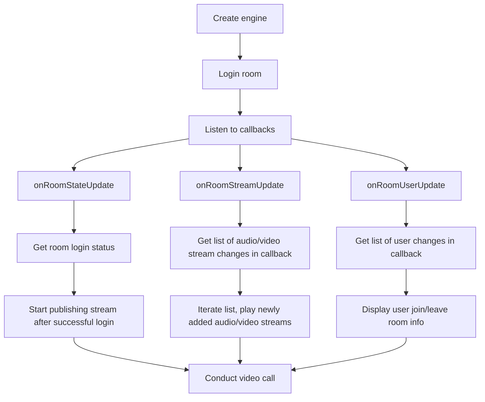
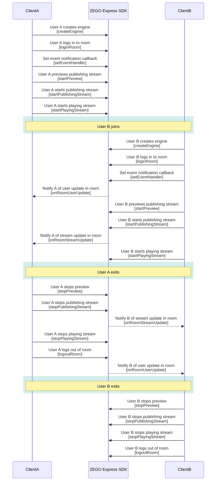

# Multiplayer Video Call

- - -

## Feature Introduction

This document demonstrates how to use the ZEGO Express SDK to construct a multiplayer video call scenario, that is, to implement multi-to-multi real-time audio and video interaction. Users can conduct real-time video calls with other users in the room, publishing and playing streams with each other. This scenario can be used for multiplayer real-time video chat, video conferences, etc.

## Prerequisites

Before applying the multiplayer video call scenario, please ensure:

- You have created a project in the [ZEGOCLOUD Console](https://console.zegocloud.com) and applied for a valid AppID and AppSign. For details, please refer to [Console - Project Information](/console/project-info).
- You have integrated the ZEGO Express SDK in the project and implemented basic audio and video publishing and playing functions. For details, please refer to [Quick Start - Integration](/real-time-video-ios-oc/quick-start/integrating-sdk) and [Quick Start - Implementation Flow](/real-time-video-ios-oc/quick-start/implementing-video-call).


## Sample Source Code Download

Please refer to [Sample Source Code](/real-time-video-ios-oc/quick-start/run-example-code) to get the source code.

For related source code, please check the files in the "/ZegoExpressExample/Examples/Scenes/VideoForMultipleUsers" directory.

## Usage Steps

This section will introduce how to use the ZEGO Express SDK to implement multiplayer video calls.

- The flow chart of multiplayer video call is as follows:


{/*
<Frame width="512" height="auto" caption=""></Frame>
*/}

- The API call sequence diagram is as follows:


{/*
<Frame width="512" height="auto" caption=""></Frame>
*/}

  <Note title="Note">


  ZEGO Express SDK can support multiplayer video calls. The above sequence diagram takes real-time video calls between 2 room members as an example. It is recommended that developers refer to the above flow to design their own multiplayer real-time video call scenarios.
</Note>


### 1 Create engine

Call the [createEngine](@createEngineWithProfile) interface, passing the applied AppID and AppSign into the parameters "appID" and "appSign", to create the engine singleton object.

If you need to register a callback handler, you can pass the object that implements [ZegoEventHandler](@-ZegoEventHandler) (for example, "self") into the parameter "eventHandler". If you don't need to register a callback handler, you can pass "nil" into the parameter "eventHandler". After creating the engine, if you still need to register a callback, you can set the callback handler by calling the [setEventHandler](@setEventHandler-ZegoExpressEngine) interface.

```objc
ZegoEngineProfile *profile = [ZegoEngineProfile new];
// Please obtain through official website registration, format: 1234567890
profile.appID = appID;
// Please obtain through official website registration, format: @"0123456789012345678901234567890123456789012345678901234567890123" (total 64 characters)
profile.appSign = appSign;
//General scenario access
profile.scenario = ZegoScenarioDefault;
// Create engine and register self as eventHandler callback. If you don't need to register callback, the eventHandler parameter can be nil, and you can call the "setEventHandler:" method later to set callback
[ZegoExpressEngine createEngineWithProfile:profile eventHandler:self];
```


### 2 Enable in-room user change notification

Developers need to set "isUserStatusNotify" in [ZegoRoomConfig ](@-ZegoRoomConfig) to "true" when each user logs in to the room, to receive callback notifications for other users entering and leaving the room.

```objc
ZegoRoomConfig *roomConfig = [ZegoRoomConfig defaultConfig];
roomConfig.isUserStatusNotify = YES;
[[ZegoExpressEngine sharedEngine] loginRoom:@"room_id_1" user:[ZegoUser userWithUserID:@"user_id_1"] config:roomConfig];
```

### 3 Set event notification callbacks

To implement multiplayer video call functionality, you need to listen to the addition and deletion of users and streams in the room and handle them accordingly. You can set related callbacks through [setEventHandler](@setEventHandler-ZegoExpressEngine).

#### Listen to user changes in the room

Register the [onRoomUserUpdate](@onRoomUserUpdate) callback to listen to user changes in the room. The addition and deletion of users already logged in to the room will trigger this callback.

The "updateType" parameter in the callback indicates the type of user change in the room. The values of this parameter are as follows:

|User Change Type|Enumeration Value|Description|
|-|-|-|
|User Addition|ZegoUpdateTypeAdd|Users in the room increase, "userList" is the list of added users.|
|User Deletion|ZegoUpdateTypeDelete|Users in the room decrease, "userList" is the list of deleted users.|

When a user logs in to the room for the first time, if there are other users in this room, the newly logged-in user will receive the added type user list through this callback, that is, the callback where "updateType" is "ZegoUpdateTypeADD". This user list is the users already existing in the room.

<Warning title="Note">


- Only when status notification is allowed when logging in to the room with [loginRoom](@loginRoom), that is, when "isUserStatusNotify" in [ZegoRoomConfig](@-ZegoRoomConfig) is set to "true" (default is "false"), can you listen to the [onRoomUserUpdate](@onRoomUserUpdate) callback.
- When the number of people in the room exceeds 500, this callback will become invalid.
</Warning>

```objc
// Notification callback for other users increasing or decreasing in the room
- (void)onRoomUserUpdate:(ZegoUpdateType)updateType userList:(NSArray<ZegoUser *> *)userList roomID:(NSString *)roomID {
    // Update UI or perform other operations here
}
```

#### Listen to stream changes in the room

To listen to stream changes in the room, you need to register the [onRoomStreamUpdate](@onRoomStreamUpdate) callback. When other users in the room add or delete streams, this callback will be triggered to notify the changed stream list.

The "updateType" parameter in the callback indicates the type of stream change in the room. The values of this parameter are as follows:

|Stream Change Type|Enumeration Value|Description|
|-|-|-|
|Stream Addition|ZegoUpdateTypeAdd|Streams in the room increase, "streamList" is the list of added streams.|
|Stream Deletion|ZegoUpdateTypeDelete|Streams in the room decrease, "streamList" is the list of deleted streams.|


When a user logs in to the room for the first time, if there are other users publishing streams in this room, they will receive the stream addition list, that is, the callback where "updateType" is "ZegoUpdateTypeADD".

```objc
- (void)onRoomStreamUpdate:(ZegoUpdateType)updateType streamList:(NSArray<ZegoStream *> *)streamList extendedData:(NSDictionary *)extendedData roomID:(NSString *)roomID {
    // Users can implement corresponding business logic here
}
```

### 4 Start publishing/playing stream

Please refer to [Quick Start - Implementation Flow](/real-time-video-ios-oc/quick-start/implementing-video-call) to complete "publishing stream" and "playing stream" related operations in sequence.

### 5 Stop video call

During the call, if users in the room need to end the call, please refer to [Quick Start - Implementation Flow](/real-time-video-ios-oc/quick-start/implementing-video-call) to complete related operations in sequence.
