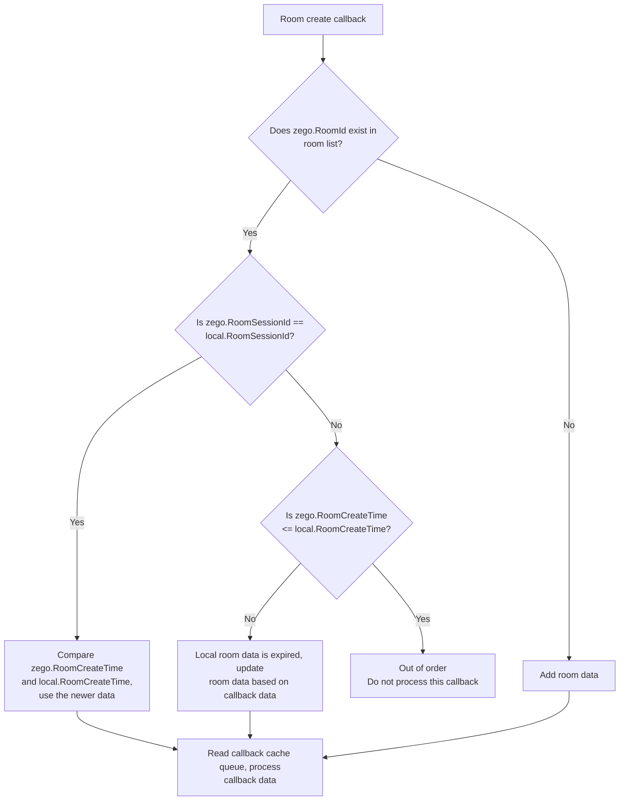
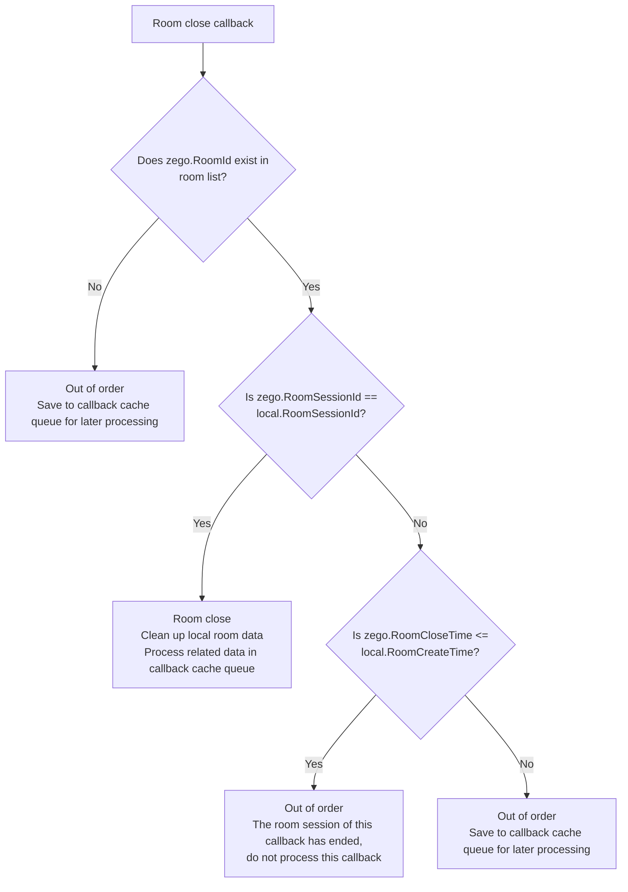

# Solution for Maintaining Room List via Callbacks

- - -

## Operation scenario

When developers frequently create and close rooms within a short period of time, the [Room Created Callback](/real-time-video-server/callback/room/created) and [Room Destroyed Callback](/real-time-video-server/callback/room/destroyed) provided by ZEGO do not guarantee that the order of results is consistent with the order of execution by the developer.

When developers need to rely on the [Room Created Callback](/real-time-video-server/callback/room/created) and [Room Destroyed Callback](/real-time-video-server/callback/room/destroyed) to maintain a local room list, the inconsistency between the callback order and the execution order may cause some business errors.

For example, the developer's operation order on rooms is:

1. User u1 logs in, room r1 is created, triggering room created callback c1;
2. User u1 logs out, room r1 is closed, triggering room destroyed callback c2;
3. User u1 logs in, room r1 is created again, triggering room created callback c3.

After passing through the callback service, the order of reaching the developer's server may become:

1. Room r1 created callback c3;
2. Room r1 created callback c1;
3. Room r1 destroyed callback c2.

The developer updates the local room information based on the order of callbacks. Room r1 will be deleted, but in fact user u1 is still in the room r1 created the second time.

## Operation steps

To solve the problems caused by the above callback out-of-order, ZEGO recommends that developers use the following solution to maintain the local room list.

<Warning title="Warning">


This solution solves the out-of-order problem based on the situation where callbacks are not lost. If callbacks are lost, it cannot be solved.

</Warning>


### Pay attention to key callback parameters

Pay attention to the key parameters of [Room Created Callback](/real-time-video-server/callback/room/created) and [Room Destroyed Callback](/real-time-video-server/callback/room/destroyed).

| Parameter |	Description |
| -- | -- |
| event | <p>Event name:</p><ul><li>Room created: [room_create](/real-time-video-server/callback/room/created)</li><li>Room closed: [room_close](/real-time-video-server/callback/room/destroyed)</li></ul> |
| room_id | Room ID. |
| room_session_id | <p>Unique identifier of the room lifecycle, which remains unchanged during the entire lifecycle of the room.</p><p>This parameter is consistent with the parameter room_seq in the <a href="/real-time-video-server/callback/room/logged-in">User Logged in Callback</a> and <a href="/real-time-video-server/callback/room/logged-out">User Logged out Callback</a>.</p>|
| room_create_time | Room creation time, unit: milliseconds. This parameter exists in [Room Created Callback](/real-time-video-server/callback/room/created). |
| room_close_time | Room destruction time, unit: milliseconds. This parameter exists in [Room Destroyed Callback](/real-time-video-server/callback/room/destroyed). |

### Maintain local room list

Maintain the local room list based on room_id, room_session_id, and room_create_time.

The data structure of the local room list is as follows:

```php
{
    RoomInfo: {
        RoomID: room_id,
        RoomSessionId: room_session_id,
        RoomCreateTime:room_create_time,
        ... // Other data that needs to be saved for business
    },
    UserList:... // Please refer to "Solution for Maintaining Room User List via Callbacks"
}
```

### Processing judgment logic

After receiving the [Room Created Callback](/real-time-video-server/callback/room/created) and [Room Destroyed Callback](/real-time-video-server/callback/room/destroyed), update the local room list.

The field descriptions in the images below are as follows:

| Field prefix | Meaning |
| -- | -- |
| zego.* | Parameters in ZEGO callbacks. |
| local.* | Parameters maintained locally by the developer. |

- Room created callback processing flow:


{/*
    <Frame width="512" height="auto" caption=""></Frame>
*/}


- Room destroyed callback processing flow:


{/*
    <Frame width="512" height="auto" caption=""></Frame>
*/}
