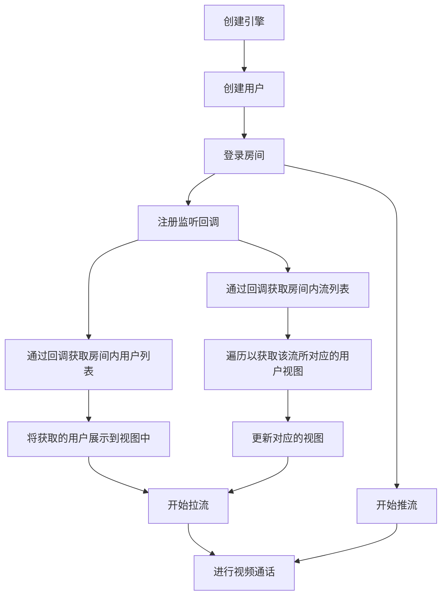
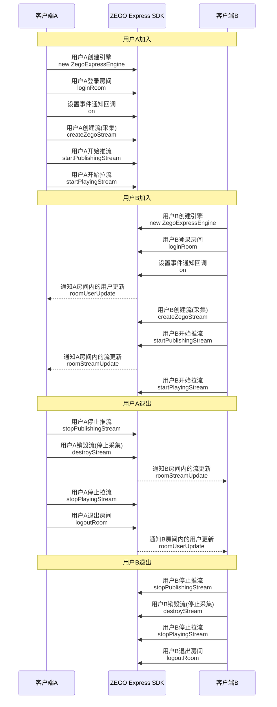

# 多人视频通话

---

## 功能介绍

本文展示了如何使用 ZEGO Express SDK 构造多人视频通话场景，即实现多对多实时音视频互动。用户可在房间内与其余用户进行实时视频通话，互相推拉流。该场景可用于多人实时视频聊天、视频会议等。


## 前提条件

在应用多人视频通话场景之前，请确保：

- 已在 [ZEGO 控制台](https://console.zego.im) 创建项目，并申请有效的 AppID 和 Server 地址，详情请参考 [控制台 - 项目信息](/console/project-info)。
- 已在项目中集成 ZEGO Express SDK，并实现了基本的音视频推拉流功能，详情请参考 [快速开始 - 集成](/real-time-video-web/quick-start/integrating-sdk) 和 [快速开始 - 实现流程](/real-time-video-web/quick-start/implementing-video-call)。

## 示例源码下载

请参考 [下载示例源码](/real-time-video-web/quick-start/run-example-code) 获取源码。

相关源码请查看ZEGO Express SDK “src/Examples/Scenes/VideoForMultipleUsers” 目录下的文件。

## 使用步骤

本节将介绍如何使用 ZEGO Express SDK 实现多人视频通话。

- 流程图如下：


{/*
  <Frame width="512" height="auto" caption=""></Frame>
*/}


- API 调用时序图如下:


{/*
  <Frame width="512" height="auto" caption=""></Frame>
*/}

<Note title="说明">


   ZEGO Express SDK 可支持多人视频通话，如上时序图以 2 名房间成员间的实时视频通话为例，建议开发者参考上述流程设计自己的多人实时视频通话场景。

</Note>


### 1 创建引擎

创建 [ZegoExpressEngine](@-ZegoExpressEngine) 引擎实例，将申请到的 AppID 传入参数 “appID”，将接入服务器地址传入参数 “server”。

<Note title="说明">
- “server” 为接入服务器地址，获取的方式请参考
[控制台 - 项目信息](/console/project-info#配置信息) 。
- 3.6.0 版本及以上 SDK，server 可以改成空字符、null、undefined 或者随意字符，但不能不填。
</Note>


```javascript
const zg = new ZegoExpressEngine(appID, server);
```

### 2 开启房间内用户变化通知

开发者需在每位用户调用 [loginRoom](@loginRoom) 接口登录房间时，将 [ZegoRoomConfig](@-ZegoRoomConfig) 中的 “userUpdate” 设置为 “true” ，用于接收其他用户进出房间的回调通知（即 [roomUserUpdate](@roomUserUpdate)）。

```javascript
const isLogin = await zg.loginRoom(
    roomID,
    token,
    { userID },
    { userUpdate: true }
  );
```


### 3 监听回调事件

为实现多人视频通话功能，需要监听房间内用户和流的增减并做出相应处理，开发者可根据实际需要，实现 ZegoEvent（包含 [ZegoRTCEvent](@-ZegoRTCEvent) 和 [ZegoRTMEvent](@-ZegoRTMEvent)）中的某些方法，创建引擎后可通过调用 [on](https://doc-zh.zego.im/article/api?doc=Express_Video_SDK_API~javascript_web~class~ZegoExpressEngine#on) 接口设置回调。


#### 监听房间内的用户变化

<Warning title="注意">


只有调用 [loginRoom](@loginRoom) 登录房间时设置了关注用户变化，即 [ZegoRoomConfig](@-ZegoRoomConfig) 中的 “userUpdate” 设置为 “true”（默认值为 “false”）时，才能监听 [roomUserUpdate](@roomUserUpdate) 回调。

</Warning>


为了监听房间内的用户变化，需注册 [roomUserUpdate](@roomUserUpdate) 回调，已登录房间内用户的新增和删除都会触发该回调，开发者可以根据实际需要在回调中实现自己的业务逻辑。

回调中 “updateType” 参数指明了房间内用户变化的类型，该参数取值如下：

| 用户变化类型 | 枚举值 | 说明|
|-|-|-|
| 用户新增 | ADD | 房间内用户增加（即加入房间），“userList” 为新增的用户列表。|
| 用户减少 | DELETE | 房间内用户减少（即退出房间），“userList” 为减少的用户列表。|

用户首次登录房间时，若此房间内已存在其他用户，该新登录用户会通过此回调接收到新增类型的用户列表，即 “updateType” 为 “ADD” 的回调，该用户列表为房间内已存在的用户。


```javascript
zg.on('roomUserUpdate', (roomID, updateType, userList) => {
    console.log('roomUserUpdate roomID ', roomID, streamList);
    if (updateType === 'ADD') {
        // update view
    } else if(updateType == 'DELETE') {
        // update view
    }
});
```


#### 监听房间内的流变化

<Warning title="注意">


当某条流被删除时，如果开发者正在调用 [startPlayingStream](@startPlayingStream) 接口拉取该流，请调用 [stopPlayingStream](@stopPlayingStream) 接口停止拉流，否则 SDK 会报拉流错误。

</Warning>


为监听房间内的流变化，需注册 [roomStreamUpdate](@roomStreamUpdate) 回调，已登录房间内流的新增和删除都会触发该回调，开发者可以根据实际需要在回调中实现自己的业务逻辑。

回调中 “updateType” 参数指明了房间内流变化的类型，该参数取值如下：

| 流变化类型 | 枚举值 | 说明 |
|-|-|-|
| 流新增 | ADD | 房间内流增加，“streamList” 为新增的流列表。|
| 流减少 | DELETE | 房间内流减少，“streamList” 为减少的流列表。|

用户首次登录房间时，若此房间内存在其他用户正在推流，会接收到流新增列表，即 “updateType” 为 “ADD” 的回调。


```javascript
zg.on('roomStreamUpdate', (roomID, updateType, streamList) => {
    console.log('roomStreamUpdate roomID ', roomID, streamList);
    if(updateType === 'ADD') {
    	// update view
    } else if(updateType == 'DELETE') {
    	// update view
    }
});
```


### 4 其他操作

请参考 [快速开始 - 实现流程](/real-time-video-web/quick-start/implementing-video-call) 依次完成登录房间、推流和拉流相关操作。
